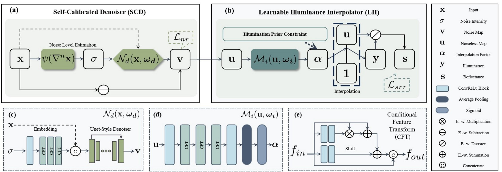
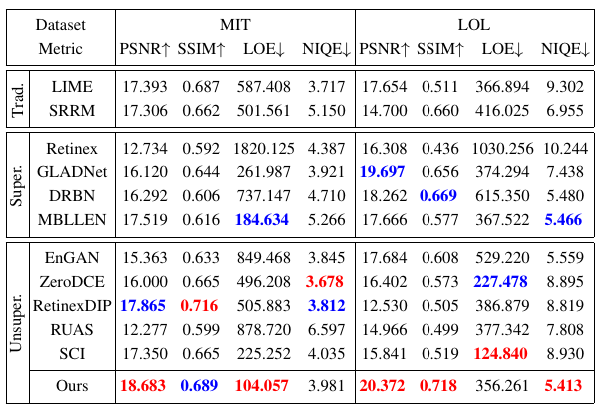

# Unsupervised low-light image enhancemnet

## Network Architecture

 

## Installation

1. Clone our repository

2. Make conda environment

3. Install dependencies

```
conda install pytorch=1.8 torchvision cudatoolkit=10.2 -c pytorch
pip install -r requirements.txt
```

4. Install basicsr

```
python setup.py develop
```

## Demo

The dataset we have split can be downloaded from the following links:  [lol](https://pan.baidu.com/s/1NnS6W8ewwLaWVSfA2SAVKg?pwd=1oe1) and [mit](https://pan.baidu.com/s/1vUhjZmf_akBbwRUx_UZmaw?pwd=cldm). Put them in the 'datasets' folder.

You can find pretrained models at the following links: [lol](https://pan.baidu.com/s/1aI24TX8bElRYYJWHQfMTCQ?pwd=yoxy) and [mit](https://pan.baidu.com/s/1jDYnsrdsEd9iYJIEdQXR-w?pwd=hiql). Place them in the 'pretrained_models' folder and then run the command:


```
python basicsr/test.py -opt configs/lol_test.yml
python basicsr/test.py -opt configs/mit_test.yml
```

If you want to train the model yourself, please download the pretrained denoise network from this [link](https://pan.baidu.com/s/1vNAYwNX_Cc1N1vsKl0E4jg?pwd=3cvu) and place it in the 'pretrained_models' folder and then run the command:

```
python basicsr/train.py -opt configs/lol.yml
python basicsr/train.py -opt configs/mit.yml
```


# Result

 

**Acknowledgment:** This code is based on the [BasicSR](https://github.com/xinntao/BasicSR) toolbox 
